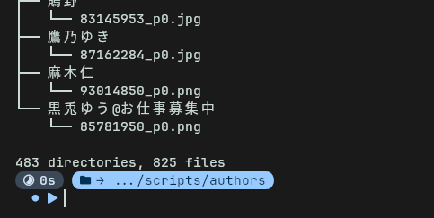

# tree
如其名 列出目录内文件
``` bash
tree

// 查找深度
tree -L 2
```



# bat
cat++
``` bash
bat file.txt
```

# less
cat分页版
``` bash
less file.txt
```

# find
找文件
``` bash
find [path] [-name/type/size ...]
```

# grep
找文件内容
``` bash
grep "mikun" file.txt
-i: 忽略大小写
-n: 显示行号
-r: 递归搜索
-v: 反向查找 (说人话就是找没有的)
-w: 精确匹配单词 (搜miku找不到mikun)
```

# sed
流编辑文本
``` bash
sed %command% [file]
-i: 应用到文件
%command%:
    "s/before/after/g": 全局替换
    "content/d": 删除
```

# nc
shell --- netport
``` bash
nc [host] [port]
-l: listen 作为服务器
-z: zero-I/O 扫描模式 不发送数据
-v: 详细信息
-u: udp (不加默认tcp)
-U: uds
```

# socat
nc++ (customport --- customport)
``` bash
socat <address-1>[,fork] <address-2>
-v: 打印到终端
fork: 支持fork子进程 (并发)
<address>:
    -: shell
    "TCP:<ip>:<port>"
    "TCP-LISTEN:<port>"
    "UNIX-CONNECT:<port>"
    "UNIX-LISTEN:<port>"
```