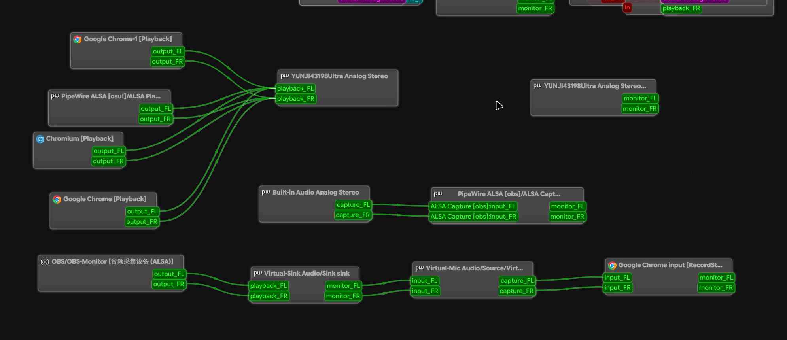

arch上要和朋友麦 而oopz官方无linux版本 网页版本身不提供降噪功能~~而且舍友电脑风扇巨吵~~

遂用obs做一个麦的降噪


hyprland.conf
``` ini
exec-once = [workspace 10 silent] obs

# 创建虚拟声卡
exec-once = pactl load-module module-null-sink media.class=Audio/Sink sink_name=Virtual-Sink
exec-once = pactl load-module module-null-sink media.class=Audio/Source/Virtual sink_name=Virtual-Mic

# 根据自己需要调整sleep 保证虚拟声卡创建完毕
exec-once = sleep 2 && pw-link OBS-Monitor:output_FL Virtual-Sink:playback_FL
exec-once = sleep 2 && pw-link OBS-Monitor:output_FR Virtual-Sink:playback_FR

exec-once = sleep 2 && pw-link Virtual-Sink:monitor_FL Virtual-Mic:input_FL
exec-once = sleep 2 && pw-link Virtual-Sink:monitor_FR Virtual-Mic:input_FR
```
如下 (qpwgraph)



### 从睡眠/休眠恢复时 重新检测usb后obs的输出被自动接到了耳机 ~~结果就是能听到自己的声音~~

connect-audio.sh
``` bash
# 掐断obs-monitor所有输出连接 (powered by gemini
# sleep个maginnum也是给usb时间...
sleep 5 && pw-link -l | awk '/^OBS-Monitor/ {src=$1; p=1; next} /^[^ ]/ {p=0} p && /|->/ {print src, $2}' | xargs -n 2 pw-link -d

pw-link OBS-Monitor:output_FL Virtual-Sink:playback_FL
pw-link OBS-Monitor:output_FR Virtual-Sink:playback_FR
```

hypridle.conf
``` ini
general {
    after_sleep_cmd = ~/.config/hypr/custom/scripts/connect-audio.sh
}
```

手动拔掉耳机重连依旧会有这个问题 暂时没找到什么好的办法