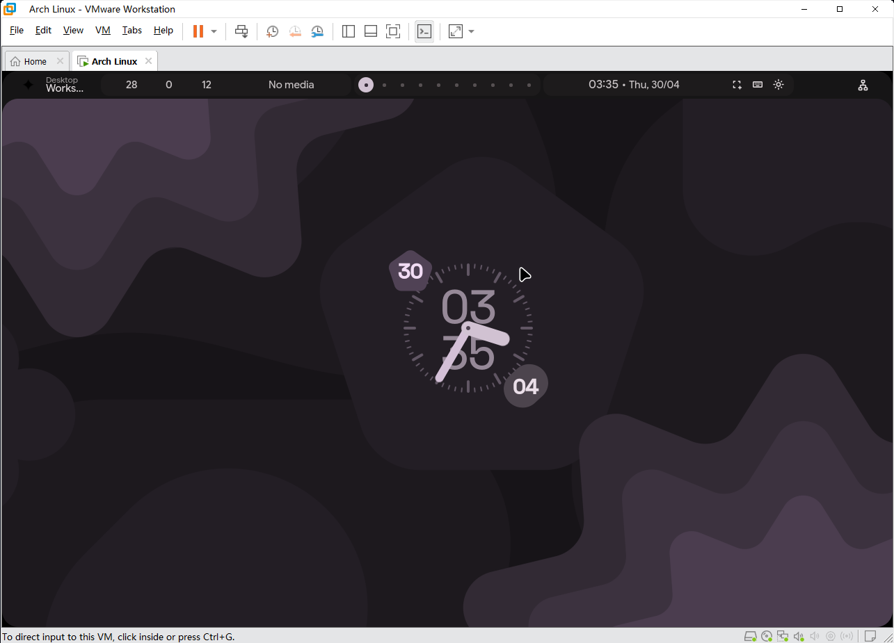

这两天没少刷到hypeland 极致ui极致动画极致beauty 给我看手痒了...

~~正好复健下fastfetch~~

# vmware环境

    首先是welcome窗口没弹出来

    kitty貌似用不了vmware的虚拟显卡 改用了~~konsole~~ foot

## somehow...

- ### *更换Dolphin的默认终端模拟器*
    修改 ~/.config/kdeglobals
    
``` toml
[General]
TerminalApplication=foot
TerminalService=foot.desktop
```

> 详见[wiki](https://wiki.archlinuxcn.org/wiki/Dolphin)

## themes

[end-4's dots-hyprland](https://github.com/end-4/dots-hyprland)

- ### ~~默认崩溃状态~~
    关闭硬件加速后正常了
``` bash
env = QT_QUICK_BACKEND,software
```



- ### 后台存在应用时 按super(win)展示视图就崩溃
    ~~认为是同vmware下的兼容问题无解~~

    于配置中完全关闭Super键功能即可 (当然也就废掉这个win+tab了233)

---
> ***vmware不中啊 换HyperV捏***
# HyperV环境
- ## hyprland启动顺利
    
- ## [end-4's dots-hyprland](https://github.com/end-4/dots-hyprland)
    
    
    一切正常 但是卡的批爆

    编译dxgkrnl无果 ~~不是很懂你们gcc~~

    编译过程参照[该项目](https://github.com/notify-bibi/dxgkrnl-dkms-git)

    看不懂一直找不到dxgkrnl.h 求教懂的群u捏

# WSL

兜兜转转还是回到WSL 与windows相性最好 也是微软亲儿子

那为什么不一开始就选WSL?

~~因为闲的蛋疼纯折腾~~

[ a few days later... ]

完全跑不起来 3d加速也开了但也是寄 
