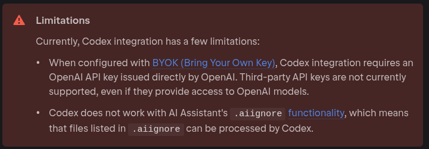

idea ai-assistant插件直接提供的 codex 对 byok 支持有限 故用实验性的acpagent进行配置



先安装需要的acp...
> https://aur.archlinux.org/packages/codex-acp

codex-acp 官方并不支持类似 codex -c 的方式传递配置 故只能用 CODEX_CONFIG 环境变量
``` json
{
  "default_mcp_settings":{ },
  "agent_servers": {
    "gpt": {
      "command": "/usr/bin/codex-acp",
      // npm包 以pnpm示例
      // "command": "pnpm",
      // "args": [
      //   "dlx",
      //   "@agentclientprotocol/codex-acp"
      // ]
      "env": {
        "CODEX_CONFIG": "your_config",
        "CODEX_API_KEY": "your_key"
      }
    }
  }
}
```

``` bash
yq -o=json -I=0 '.' config.toml | jq -Rs .
```

不写env其实也会去读~/.codex/config.toml 但还是没法用内置的codex得自己装acp

~~总之就是Jb跟openai绝对有py~~

> https://www.jetbrains.com/help/ai-assistant/acp.html