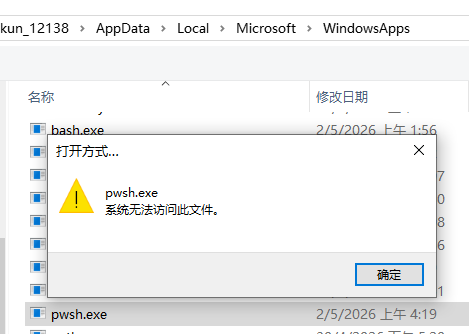

windows系统自带的powershell是古早的5.1


尽管这个版本跟系统绑死了 但powershell7是可以独立安装的
``` powershell
winget install --id Microsoft.PowerShell --source winget
```

> 官方文档 https://learn.microsoft.com/powershell/scripting/install/install-powershell-on-windows?view=powershell-7.6

MSIX包安装在了C:\Program Files\WindowsApps下 安装目录名包含了版本名... 这意味着我们不能用简单的链接固定路径加入菜单...

好在ms提供了环境变量 对于powershell7 启动只需:

``` batch
pwsh
:: 或 pwsh.exe
```


> Tip: 其实你还是可以在 %LocalAppData%\Microsoft\WindowsApps\ 找到0kb的pwsh.exe 貌似是windows独有的"执行别名" \TODO\

还碰到了设置.ps1格式默认打开方式的问题...



~~找死....jpg~~
``` bat
ftype Microsoft.PowerShellScript.1="pwsh.exe" -File "%1" %*
assoc .ps1=Microsoft.PowerShellScript.1
```
> 用 ftype 查看所有定义的文件类型 | 启动命令
