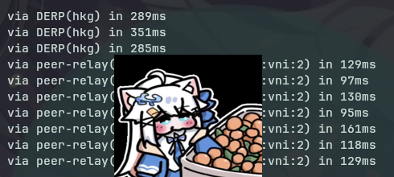

arch上使用碰到了不少问题 故撰此备忘录

## first of all
``` bash
sudo systemctl enable --now tailscaled
```

## tailscale up 挂起没反应
关闭你的猫猫 tun, tailscale默认也是当tun

自行设置浏览器代理 / --qr 二维码登录

> 和你的猫猫tun共存: 
> https://blog.ichr.me/post/tailscale-mihomo-quantumult-x/

## 直连还是中继
``` bash
tailscale ping [ip]/[device_name]

... via xxx.xxx.xxx.xxx # 直连
... via DERP(hkg) # 中继
```

## 打洞老失败 derp延迟高 ~~不是怎么老被炸啊~~
Peer Relays 或自建derp节点

这里选择前者 也是官方推荐的

!!如选择自建节点 不要部署在不信任的服务器提供商下!!

1. 中继设备入网(废话)
   
2. 中继设备配置
    ``` bash
    tailscale set --relay-server-port=40000
    ```

3. tailscale后台配置
   ``` json
    {
        "grants": [
            {
                "src": ["tag:us-east-vpc"], // Devices that can be accessed through the peer relay
                "dst": ["tag:us-east-relays"], // Devices functioning as peer relays for the src devices
                "app": {
                    "tailscale.com/cap/relay": [] // The relay capability doesn't require any parameters
                }
            }
        ]
    }
   ```
   注意若要删除设备的tag则需解绑后重新入网 推荐给设备打唯一tag或直接设备名(当然前提是不改)

- 延迟对比 (ucloud的百元hk)

    
> 官方文档: 
> https://tailscale.com/docs/features/peer-relay